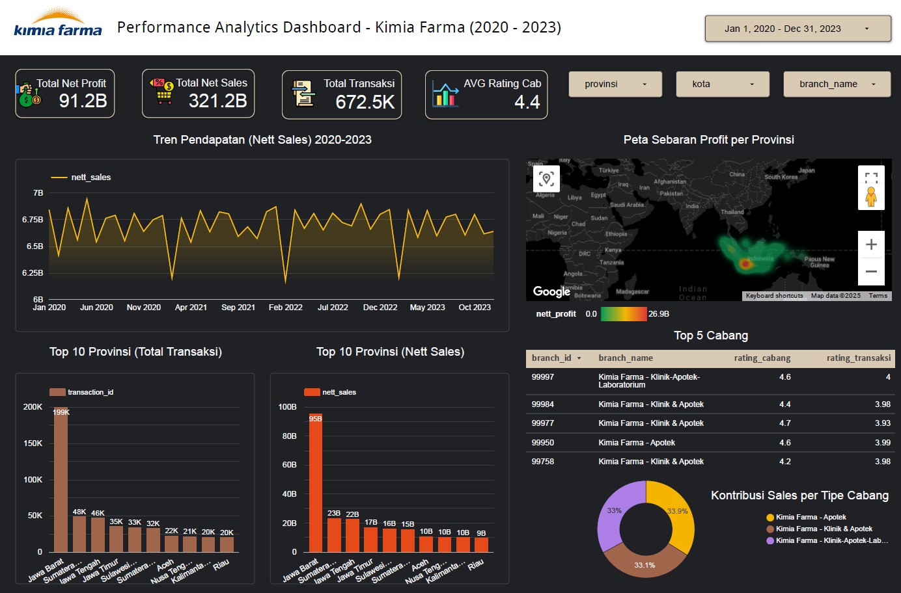

# Kimia Farma Business Performance Analysis (2020-2023) - Rakamin Academy Project

**Author:** Giovincent Ricel's Tanoto  
**Live Dashboard Link:** https://lookerstudio.google.com/reporting/a864e7d9-71b4-4dd6-8360-dff0605682e8

---

### 1. 🎯 Project Overview & Objective

This project is part of the Virtual Internship Experience by Rakamin Academy, in collaboration with Kimia Farma.

The challenge was to evaluate Kimia Farma's business performance from 2020 to 2023. The primary objective is to identify sales trends, profitability drivers, and branch performance to provide actionable business recommendations.

### 2. 🛠️ Tech Stack Used

* **Google BigQuery:** Used as the cloud Data Warehouse to store, process, and transform raw data.
* **SQL (Google Standard SQL):** Used for the complete ELT process, joining data from 4 source tables, and creating new calculated business metrics.
* **Google Looker Studio:** Used for data visualization and building the final interactive dashboard.

### 3. ⚙️ Project Workflow

This project was executed in three main phases:

**1. Data Loading (ETL):**
* Uploaded 4 provided CSV datasets (`kf_final_transaction.csv`, `kf_product.csv`, `kf_kantor_cabang.csv`, `kf_inventory.csv`) into a `kimia_farma` dataset in Google BigQuery.
* Table schemas were manually defined during the upload process to ensure data integrity (e.g., setting IDs as `STRING`, prices as `NUMERIC`).

**2. Data Transformation (SQL):**
* Created a single, unified analysis table (`tabel_analisa_kf`) by joining three source tables (transactions, products, and branches).
* The 'kf_inventory' table was intentionally excluded from this primary aggregation. This is because the three joined tables already provided all mandatory columns required by the project brief  (such as nett_sales, nett_profit, branch_name, and product_name). Therefore, adding the inventory table was not necessary for this specific analysis.
* Engineered new calculated fields using SQL to meet business requirements, including:
    * `persentase_gross_laba`: Calculated using `CASE WHEN` logic based on product price tiers.
    * `nett_sales`: Calculated as the price after applying discounts.
    * `nett_profit`: Calculated based on `nett_sales` multiplied by `persentase_gross_laba`.
* *The primary SQL transformation query is available in the `tabel_analisa_kf.sql` file in this repository.*

**3. Data Visualization (Dashboard):**
* Connected the final `tabel_analisa_kf` from BigQuery directly to Google Looker Studio.
* Designed and built an interactive dashboard covering all required KPIs, including filter controls, KPI snapshots, trend analysis, regional comparisons, and geo-spatial analysis.

### 4. 📊 Final Dashboard

The following are screenshots of the final dashboard. It was designed with a top-down layout, flowing from a high-level overview (KPI Snapshot) to a granular deep-dive analysis.

